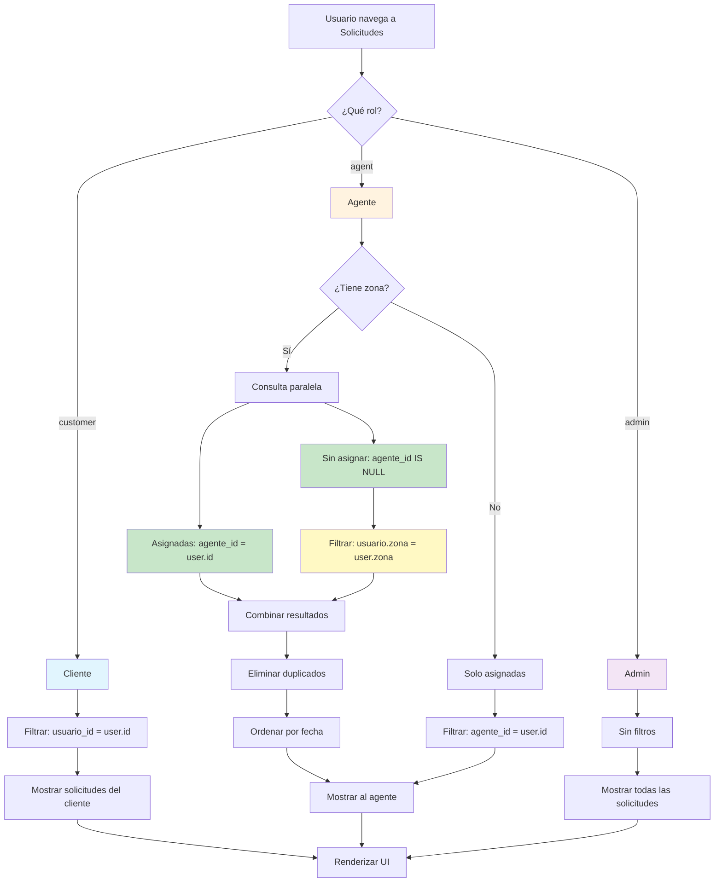

# Documentación: Flujo de Solicitudes por Zona

**Fecha**: 2025-02-03
**Versión**: 1.0.0
**Archivo**: `app/(tabs)/requests.tsx`

---

## 📋 **Tabla de Contenidos**

1. [Descripción General](#descripción-general)
2. [Lógica por Rol](#lógica-por-rol)
3. [Casos de Uso](#casos-de-uso)
4. [Flujograma](#flujograma)
5. [Implementación Técnica](#implementación-técnica)
6. [Validación de Datos](#validación-de-datos)
7. [Manejo de Errores](#manejo-de-errores)
8. [Pruebas Recomendadas](#pruebas-recomendadas)

---

## 🎯 **Descripción General**

El sistema de solicitudes implementa un control de acceso basado en **roles** y **zonas geográficas**, permitiendo una distribución eficiente de solicitudes entre agentes y clientes.

### **Objetivos Principales**

- ✅ **Clientes**: Solo ven sus propias solicitudes
- ✅ **Agentes**: Ven sus solicitudes asignadas + solicitudes sin asignar de su zona
- ✅ **Admins**: Ven todas las solicitudes del sistema

### **Beneficios**

- **Distribución equitativa**: Los agentes pueden auto-asignarse solicitudes de su zona
- **Privacidad de datos**: Los clientes solo acceden a su información
- **Supervisión total**: Los admins tienen visibilidad completa
- **Optimización de recursos**: Reducción de la carga mediante consultas paralelas

---

## 👥 **Lógica por Rol**

### **1. CLIENTE (customer)**

```typescript
if (user.rol === 'customer') {
  query = query.eq('usuario_id', user.id);
}
```

**Comportamiento**:
- Solo ve solicitudes donde `usuario_id === user.id`
- No ve solicitudes de otros clientes
- Puede ver el agente asignado a sus solicitudes

**SQL Query**:
```sql
SELECT *,
  usuario:users(id, nombre, apellido_paterno, apellido_materno, empresa, zona),
  agente:users(id, nombre, apellido_paterno, apellido_materno, categoria, zona)
FROM requests
WHERE usuario_id = [user.id]
ORDER BY created_at DESC
```

---

### **2. AGENTE (agent)**

```typescript
else if (user.rol === 'agent') {
  // 1. Solicitudes asignadas al agente
  const assignedQuery = supabase
    .from('requests')
    .select(baseQuery)
    .eq('agente_id', user.id);

  // 2. Solicitudes sin asignar de su zona
  if (user.zona) {
    unassignedQuery = supabase
      .from('requests')
      .select(baseQuery)
      .is('agente_id', null)
      .order('created_at', { ascending: false });
  }
}
```

**Comportamiento**:
- **Consulta 1**: Solicitudes donde `agente_id === user.id`
- **Consulta 2**: Solicitudes donde `agente_id IS NULL` (sin asignar)
- **Filtro local**: Solo solicitudes donde `usuario.zona === user.zona`
- **Ejecución**: Paralela con `Promise.all()`
- **Combinación**: Merge y deduplicación por ID

**SQL Queries**:
```sql
-- Consulta 1: Solicitudes asignadas
SELECT *,
  usuario:users(id, nombre, apellido_paterno, apellido_materno, empresa, zona),
  agente:users(id, nombre, apellido_paterno, apellido_materno, categoria, zona)
FROM requests
WHERE agente_id = [user.id]

-- Consulta 2: Solicitudes sin asignar
SELECT *,
  usuario:users(id, nombre, apellido_paterno, apellido_materno, empresa, zona),
  agente:users(id, nombre, apellido_paterno, apellido_materno, categoria, zona)
FROM requests
WHERE agente_id IS NULL
ORDER BY created_at DESC
```

**Procesamiento en Cliente**:
```javascript
const assignedRequests = assignedResult.data || [];
const unassignedRequests = (unassignedResult?.data || []).filter(
  (req) => req.usuario?.zona === user.zona
);

// Combinar sin duplicados
const allRequests = [...assignedRequests, ...unassignedRequests];
const uniqueRequests = Array.from(
  new Map(allRequests.map((req) => [req.id, req])).values()
);

// Ordenar por fecha
data = uniqueRequests.sort(
  (a, b) => new Date(b.created_at) - new Date(a.created_at)
);
```

---

### **3. ADMIN (admin)**

```typescript
else {
  // Admins ven todas las solicitudes
  const query = supabase
    .from('requests')
    .select(baseQuery)
    .order('created_at', { ascending: false });
}
```

**Comportamiento**:
- Sin filtros de usuario o agente
- Visibilidad completa del sistema
- Orden cronológico inverso

**SQL Query**:
```sql
SELECT *,
  usuario:users(id, nombre, apellido_paterno, apellido_materno, empresa, zona),
  agente:users(id, nombre, apellido_paterno, apellido_materno, categoria, zona)
FROM requests
ORDER BY created_at DESC
```

---

## 📊 **Casos de Uso**

### **Caso 1: Cliente Crea Solicitud**

**Actores**: Cliente
**Precondiciones**: Usuario autenticado con rol `customer`

**Flujo**:
1. Cliente navega a "Solicitudes"
2. Toca botón "+" para crear solicitud
3. Llena formulario (título, mensaje, tipo, prioridad)
4. Opcional: Selecciona agente de su zona
5. Envía solicitud
6. Sistema crea solicitud con estatus `'nuevo'`

**Resultado Esperado**:
- Solicitud creada con `usuario_id = cliente.id`
- `agente_id`:
  - Si cliente seleccionó agente → `agente_id = agente_seleccionado.id`
  - Si no seleccionó → `agente_id = NULL`
- `estatus = 'nuevo'`
- Chat automático creado si se asignó agente

---

### **Caso 2: Agente Revisa Solicitudes**

**Actores**: Agente
**Precondiciones**: Usuario autenticado con rol `agent`, zona definida

**Flujo**:
1. Agente navega a "Solicitudes"
2. Sistema carga solicitudes:
   - Asignadas: Donde `agente_id = agente.id`
   - Sin asignar: Donde `agente_id IS NULL` AND `usuario.zona = agente.zona`
3. Agente puede:
   - Ver detalles de solicitudes asignadas
   - Auto-asignarse solicitudes sin asignar de su zona
   - Cambiar estatus de solicitudes asignadas
   - Iniciar chat con clientes

**Resultado Esperado**:
- Agente ve solicitudes: `[asignadas] + [sin_asignar_misma_zona]`
- Total = Solicitudes asignadas + Solicitudes sin asignar de su zona
- Orden cronológico inverso

**Ejemplo**:
```
Agente: Juan Pérez (zona: "Norte")
Solicitudes asignadas: 3
Solicitudes sin asignar de zona "Norte": 5
Total visible: 8 solicitudes
```

---

### **Caso 3: Agente Se Auto-Asigna Solicitud**

**Actores**: Agente
**Precondiciones**: Solicitud visible (sin asignar, misma zona)

**Flujo**:
1. Agente toca solicitud sin asignar
2. Toca opción "Asignar"
3. Sistema actualiza: `agente_id = agente.id`, `estatus = 'asignado'`
4. Chat automático creado entre agente y cliente
5. Notificación enviada al cliente

**SQL Update**:
```sql
UPDATE requests
SET agente_id = [agente.id],
    estatus = 'asignado',
    updated_at = NOW()
WHERE id = [request.id]
```

---

### **Caso 4: Admin Supervisa Todo**

**Actores**: Admin
**Precondiciones**: Usuario autenticado con rol `admin`

**Flujo**:
1. Admin navega a "Solicitudes"
2. Sistema carga TODAS las solicitudes sin filtros
3. Admin puede:
   - Ver todas las solicitudes del sistema
   - Reasignar agentes
   - Cambiar estatus
   - Verificar distribución de carga
   - Generar reportes

**Resultado Esperado**:
- Visibilidad 100% del sistema
- Sin restricciones de zona o agente
- Acceso a métricas globales

---

## 🔄 **Flujograma**



---

## 🔧 **Implementación Técnica**

### **Archivo**: `app/(tabs)/requests.tsx`

**Función**: `loadRequests()`
**Líneas**: 93-204

### **Estructura de Datos**

```typescript
interface RequestWithRelations extends Request {
  usuario?: {
    nombre: string;
    apellido_paterno: string;
    apellido_materno: string;
    empresa: string;
    zona?: string;
  };
  agente?: {
    nombre: string;
    apellido_paterno: string;
    apellido_materno: string;
    categoria?: string;
    zona?: string;
  };
}
```

### **Optimizaciones Implementadas**

1. **Consultas Paralelas**:
   ```typescript
   const [assignedResult, unassignedResult] = await Promise.all([
     assignedQuery,
     unassignedQuery || { data: null, error: null },
   ]);
   ```

2. **Deduplicación Eficiente**:
   ```typescript
   const uniqueRequests = Array.from(
     new Map(allRequests.map((req) => [req.id, req])).values()
   );
   ```

3. **Ordenamiento en Cliente**:
   ```typescript
   data = uniqueRequests.sort(
     (a, b) => new Date(b.created_at) - new Date(a.created_at)
   );
   ```

4. **Filtrado Temprano**:
   - Solo ejecutar consulta de sin asignar si el agente tiene zona
   - Reducir payload de datos filtrando por zona en cliente

---

## ✅ **Validación de Datos**

### **Precondiciones para Agentes**

1. **Usuario autenticado**: `user !== null`
2. **Rol correcto**: `user.rol === 'agent'`
3. **Zona definida** (opcional): `user.zona !== undefined`

### **Precondiciones para Clientes**

1. **Usuario autenticado**: `user !== null`
2. **Rol correcto**: `user.rol === 'customer'`

### **Precondiciones para Admins**

1. **Usuario autenticado**: `user !== null`
2. **Rol correcto**: `user.rol === 'admin'`

---

## ⚠️ **Manejo de Errores**

### **Tipos de Errores Manejados**

1. **Error de Conexión**:
   ```typescript
   setError(`Error al cargar las solicitudes: ${error.message}`);
   ```

2. **Usuario No Autenticado**:
   ```typescript
   if (!user) return; // Retorno silencioso
   ```

3. **Error en Consultas Paralelas**:
   ```typescript
   error = assignedResult.error || unassignedResult?.error;
   ```

### **Estados de Carga**

- `loading = true`: Muestra spinner
- `error != null`: Muestra mensaje de error + botón reintentar
- `data = []`: Muestra estado vacío

---

## 🧪 **Pruebas Recomendadas**

### **Prueba 1: Cliente Ve Sus Solicitudes**

**Preparación**:
1. Crear usuario con rol `customer`
2. Iniciar sesión con ese usuario

**Pasos**:
1. Navegar a "Solicitudes"
2. Crear 3 solicitudes
3. Verificar que solo ve sus 3 solicitudes

**Resultado Esperado**:
- ✅ Solo ve solicitudes donde `usuario_id = su_id`
- ✅ No ve solicitudes de otros clientes

---

### **Prueba 2: Agente Ve Solicitudes Asignadas + Sin Asignar de Zona**

**Preparación**:
1. Crear agente con `zona = "Norte"`
2. Crear 5 solicitudes sin asignar de zona "Norte"
3. Crear 3 solicitudes sin asignar de zona "Sur"
4. Asignar 2 solicitudes al agente

**Pasos**:
1. Iniciar sesión como agente
2. Navegar a "Solicitudes"

**Resultado Esperado**:
- ✅ Ve las 2 solicitudes asignadas
- ✅ Ve las 5 solicitudes sin asignar de zona "Norte"
- ✅ NO ve las 3 solicitudes de zona "Sur"
- ✅ Total: 7 solicitudes (2 asignadas + 5 sin asignar de su zona)

---

### **Prueba 3: Agente Sin Zona Solo Ve Asignadas**

**Preparación**:
1. Crear agente sin `zona` definida
2. Asignar 2 solicitudes al agente
3. Crear 5 solicitudes sin asignar

**Pasos**:
1. Iniciar sesión como agente
2. Navegar a "Solicitudes"

**Resultado Esperado**:
- ✅ Solo ve las 2 solicitudes asignadas
- ✅ NO ve solicitudes sin asignar (no tiene zona para filtrar)
- ✅ Total: 2 solicitudes

---

### **Prueba 4: Admin Ve Todo**

**Preparación**:
1. Crear usuario con rol `admin`
2. Crear múltiples solicitudes de diferentes clientes y zonas

**Pasos**:
1. Iniciar sesión como admin
2. Navegar a "Solicitudes"

**Resultado Esperado**:
- ✅ Ve TODAS las solicitudes del sistema
- ✅ Sin restricciones de zona o cliente
- ✅ Puede ver todos los detalles

---

### **Prueba 5: Auto-Asignación de Solicitud**

**Preparación**:
1. Agente con zona "Norte" iniciado
2. Solicitud sin asignar de zona "Norte" visible

**Pasos**:
1. Tocar solicitud sin asignar
2. Seleccionar "Asignar"
3. Verificar que desaparece de lista de sin asignar
4. Verificar que aparece en lista de asignadas

**Resultado Esperado**:
- ✅ `agente_id` actualizado a ID del agente
- ✅ `estatus` cambió a `'asignado'`
- ✅ Chat creado automáticamente
- ✅ Notificación enviada al cliente

---

## 📈 **Métricas de Performance**

### **Tiempo de Carga Esperado**

- **Cliente**: 200-500ms (1 query)
- **Agente**: 500-1000ms (2 queries paralelas + procesamiento)
- **Admin**: 300-600ms (1 query sin filtros)

### **Tamaño de Payload**

- **Por solicitud**: ~2KB (con relaciones)
- **10 solicitudes**: ~20KB
- **50 solicitudes**: ~100KB

---

## 🔐 **Seguridad**

### **Políticas RLS (Row Level Security)**

```sql
-- Política para clientes
CREATE POLICY "Customers can see their own requests"
ON requests FOR SELECT
USING (auth.uid() = usuario_id);

-- Política para agentes
CREATE POLICY "Agents can see assigned and same-zone unassigned"
ON requests FOR SELECT
USING (
  auth.uid() = agente_id OR
  (agente_id IS NULL AND
   usuario_id IN (
     SELECT id FROM users WHERE zona = (
       SELECT zona FROM users WHERE id = auth.uid()
     )
   ))
);

-- Política para admins
CREATE POLICY "Admins can see all requests"
ON requests FOR SELECT
USING (
  auth.uid() IN (SELECT id FROM users WHERE rol = 'admin')
);
```

---

## 📝 **Notas de Implementación**

1. **Por qué dos consultas para agentes**:
   - Supabase no permite filtros complejos en relaciones JOIN
   - Solución: Consultas paralelas + combinación en cliente
   - Trade-off: Más payload del servidor vs lógica más simple

2. **Por qué filtrar por zona en cliente**:
   - No es posible filtrar por campo de relación en query principal
   - Solución: Traer todo y filtrar en cliente
   - Optimización: Solo para sin asignar (usualmente menos datos)

3. **Deduplicación necesaria**:
   - Una solicitud podría aparecer en ambas consultas
   - Ejemplo: Solicitud previamente sin asignar, luego asignada al agente
   - Solución: Map con ID como clave para eliminar duplicados

---

## 🚀 **Mejoras Futuras**

1. **Paginación**: Implementar `loadMore` para listas grandes
2. **Cache**: Usar React Query o SWR para cache
3. **Realtime**: Suscribirse a cambios en solicitudes
4. **RPC Function**: Mover lógica a PostgreSQL para mejor performance
5. **Indicadores**: Mostrar contadores (asignadas, sin asignar, total)

---

## 📞 **Soporte**

Para issues o preguntas sobre este flujo:
- Revisar logs en consola del navegador/app
- Verificar políticas RLS en Supabase
- Validar que los usuarios tengan `zona` definida correctamente

---

**Fin de Documentación**
